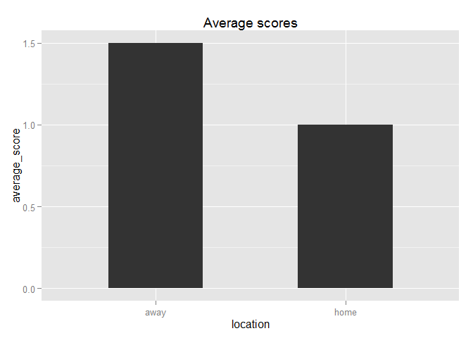

### Introduction

Are you an NHL fan? Do you always have a difficult time looking up
whether your favourite team is playing on a particular day, or the
scores of NHL games for any particular day? This package provides a
simple method to check whether your favourite team is playing on a given
day. In addition, you could look up the scores of all teams that play on
a particular day if you are curious.

### Use Cases

#### Case Study 1

Say you want to find the dates your favourite NHL team will play in the
next month.

    todayDate = as.Date("2014-11-19")
    endDate = as.Date("2014-12-19")
    # generate sequence of dates per day from today's date to next month
    monthDates = strftime(seq(from=todayDate, to=endDate, by="day"))
    # signify who your favourite team is
    favouriteTeam = "Canucks"
    # vector of booleans giving whether the team plays for each day
    boolDates = unlist(lapply(monthDates, FUN=gday, team=favouriteTeam))
    # returns a vector of dates of when your team will be playing in the next month
    monthDates[boolDates]

    ##  [1] "2014-11-19" "2014-11-20" "2014-11-23" "2014-11-25" "2014-11-28"
    ##  [6] "2014-11-30" "2014-12-02" "2014-12-04" "2014-12-06" "2014-12-07"
    ## [11] "2014-12-09" "2014-12-13" "2014-12-17"

#### Case Study 2

Following the last example, you can also generate the scores of your
favourite team from the last month and compare scores for home vs away.
Since there may be a difference in number of home and away games, we
should probably take the average score per game.

    library(plyr)
    library(dplyr)
    library(ggplot2)

    todayDate = as.Date("2014-11-19")
    # Note that this is one month back from today's date
    endDate = as.Date("2014-10-19")
    favouriteTeam = "Canucks"
    boolDates = unlist(lapply(monthDates, FUN=gday, team=favouriteTeam))
    # returns a vector of dates of when your team will be playing in the next month
    scoreDays = monthDates[boolDates]
    scoresDf = ldply(scoreDays, .fun=scores)
    homeScores = scoresDf %>% select(home, home_score) %>%
                  filter(grepl(favouriteTeam, home, ignore.case=T)) %>%
                  select(home_score)
    homeAvg = mean(homeScores[,1])
    awayScores = scoresDf %>% select(away, away_score) %>% 
                  filter(grepl(favouriteTeam, away, ignore.case=T)) %>% 
                  select(away_score)
    awayAvg = mean(awayScores[,1])
    ggData = data.frame("location"=c("home","away"), 
              "average_score"=c(homeAvg, awayAvg))
    gg = ggplot(ggData, aes(x=location, y=average_score)) + 
          geom_bar(stat="identity", width=.5) + 
          ggtitle("Average scores")

    gg

